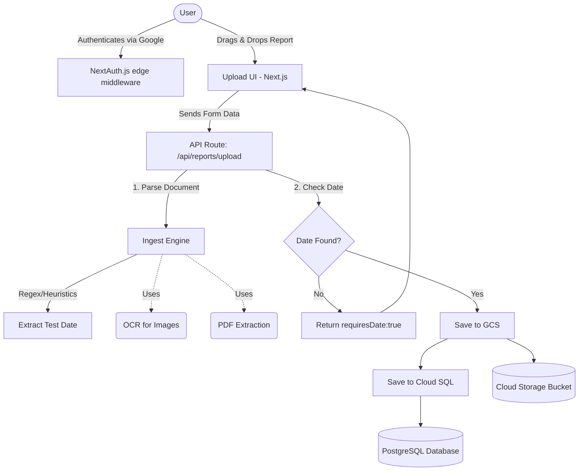

# Health Vitals Tracker

Health Vitals Tracker is a production-ready application for parsing, extracting, and securely tracking clinical lab measurements from your medical reports. It processes PDF, CSV, XLSX, DOCX, and image files to build a comprehensive history of your health metrics.

**Deployed URL:** [https://vitals-tracker-353564299092.us-central1.run.app](https://vitals-tracker-353564299092.us-central1.run.app)

## Features

- **Multi-format Support:** Upload lab reports via PDF, CSV, Excel, Word, or plain text.
- **OCR Integration:** Automatically reads text from image files (PNG, JPG, WebP) using Tesseract.js.
- **Smart Date Extraction:** Intelligently extracts the test or sample collection date directly from your reports.
- **Interactive UI:** Smooth Drag & Drop upload experience with an integrated side-by-side file viewer when manual date verification is needed.
- **Secure Persistent Storage:** Backed by Google Cloud SQL (PostgreSQL) for relational data and Google Cloud Storage (GCS) for securely keeping uploaded files.
- **Authentication:** Integrated Google Sign-In with NextAuth (Auth.js) edge-compatible setup.

## Tech Stack

- **Frontend:** Next.js 16 (App Router), React, Tailwind CSS, FontAwesome
- **Backend/API:** Next.js Server Actions & API Routes, Node.js Runtime
- **Database:** PostgreSQL (Google Cloud SQL), Prisma ORM
- **File Storage:** Google Cloud Storage
- **Parsing Engines:** `pdfjs-dist` (Layout-aware), `mammoth`, `csv-parse`, `xlsx`, `tesseract.js`
- **Deployment:** Docker, Google Cloud Run

## Architecture Overview

## Setup & Deployment
*This application is deployed on Google Cloud Run and is not intended for local self-hosting.*
