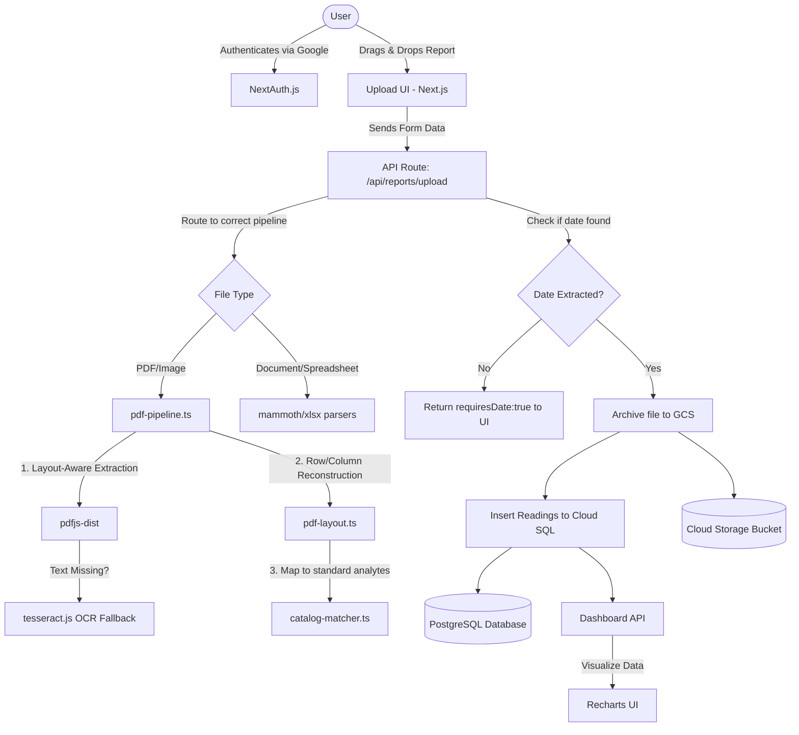

# Health Vitals Tracker

Health Vitals Tracker is a production-ready web application for parsing, extracting, and securely tracking clinical lab measurements from your medical reports. It processes PDF, CSV, XLSX, DOCX, and image files to build a comprehensive, visual history of your health metrics over time.

**Deployed URL:** [https://vitals-tracker-353564299092.us-central1.run.app](https://vitals-tracker-353564299092.us-central1.run.app)

## Features & Capabilities

- **Multi-format Support:** Upload lab reports via PDF, CSV, Excel, Word, or plain text.
- **Layout-Aware PDF Parsing:** Uses advanced coordinate-based extraction (`pdfjs-dist`) to reconstruct data rows and columns, preserving crucial tabular structures like "Name | Value | Unit | Reference Range" that traditional line-by-line parsers break.
- **OCR Integration:** Automatically reads text from image-only PDFs and standard image files (PNG, JPG, WebP) using `tesseract.js` as a robust fallback mechanism.
- **Intelligent Catalog Matching:** Matches extracted lab results against a predefined parameter catalog using aliases, acronym repair, and sanity-bound validation to ensure accurate data ingestion.
- **Smart Date Extraction:** Intelligently extracts the test or sample collection date directly from your reports.
- **Interactive Dashboard:** Visualizes your historical health data over time using dynamic Recharts graphs.
- **Secure Persistent Storage:** Backed by Google Cloud SQL (PostgreSQL) for relational data and Google Cloud Storage (GCS) for secure file archiving.
- **Authentication:** Integrated Google Sign-In with NextAuth (Auth.js) edge-compatible setup.

## Tech Stack

- **Frontend:** Next.js 16 (App Router), React, Tailwind CSS, Recharts
- **Backend/API:** Next.js Server Actions & API Routes, Node.js
- **Database:** PostgreSQL (Google Cloud SQL), Prisma ORM
- **File Storage:** Google Cloud Storage
- **Parsing Engines:** `pdfjs-dist` (Layout-aware), `tesseract.js` (OCR), `mammoth`, `csv-parse`, `xlsx`
- **Deployment:** Docker, Google Cloud Run

## Agentic Workflow Diagram

